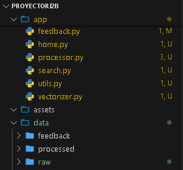

CASO DE ESTUDIO 4: Plataforma de Recuperación Multimedia Multiformato con Ranking Personalizado

Crear una plataforma que integre texto, imagen, audio y video para realizar búsquedas multimodales (texto → imagen, voz → texto, etc.). Debe permitir ranking por similitud semántica, evaluación con métricas y feedback del usuario.

Datasets:

MSR-VTT Dataset (https://www.kaggle.com/datasets/vishnutheepb/msrvtt)

YouTube8M (https://research.google.com/youtube8m/)

Free images/audio from Flickr

Módulos del Proyecto:

Crawling de imágenes, videos, subtítulos y audios.

Procesamiento multimedia: extracción de frames, transcripción, histogramas.

Vectorización conjunta de medios (CLIP, BLIP).

Ranking por similitud e interacción usuario (estrellas, clics, likes).

Evaluación del sistema con métricas multimedia.

Dashboard e interfaz de consulta multimodal.

-------- Modulo 1 (Crawling de imágenes, videos, subtítulos y audios.): 
El modulo 1 es el crawling o busqueda de datos, se hizo manual y algunos utilizando librerias directamente (crwawling)
los archivos son: 
-descarga_flicker_imagenes.py
-descargar_msr_vtt.py
-crawling.py
Para ejecutarlos el comando es asi en (.venv) C:\Users\USER\Desktop\ProyectoRI2B>, por ejemplo: 
(.venv) C:\Users\USER\Desktop\ProyectoRI2B> python crawling.py 
(.venv) C:\Users\USER\Desktop\ProyectoRI2B> python descargar_msr_vtt.py 
...
Pero ya no es necesario ejecutar los comandos porque ya les paso el archivo .zip que contiene la carpeta raw y ahi esta todos los archivos necesarios, el zip lo descomprimen en la carpeta data. 


-------Modulo 2: (Procesamiento multimedia: extracción de frames, transcripción, histogramas.)
Para el modulo 2 los archivos utilizados son "processor.py" y "processorMain.py"
Se ha procesan solo 10 elementos porque son demasiados y mi compu no sporta :V, modifican el limite para procesar mas archivos ya que sus compus son mas potentes, esto genera y guarda en las carpetas: 
processed/frames
processed/histograms
processed/transcripts

Para ejecutar solo deben ejecutar el siguiente comando en su respectivo entorno virtual
(.venv) C:\Users\USER\Desktop\ProyectoRI2B> python processorMain.py

----------------Modulo 3 (Vectorización conjunta de medios (CLIP, BLIP).)-------------------
Para el modulo 3 los archivos utilizados son "vectorizer.py" y "vectorizeMain.py"
De estas carpetas se procesa todo:
processed/frames
processed/histograms
processed/transcripts

Pero de estas solo se procesa los 10 primeros (igual por rendimiento, modifiquen para que ejecute mas)
data/raw/crawled
data/raw/flickr

Para ejecutar solo deben ejecutar el siguiente comando en su respectivo entorno virtual
(.venv) C:\Users\USER\Desktop\ProyectoRI2B> python vectorizeMain.py

y el resultado se ve en embeddings todos en formato ".pny"
processed/frames
processed/texts
...

----------------Modulo 4 _ parte 1 (Ranking por similitud)---------------
para eso se utiliza utils.py que tiene el calculo del ranking y en search.py esta la interfaz y muestra los resultados, para probar se debe ejecutar: 
(.venv) C:\Users\USER\Desktop\ProyectoRI2B> streamlit run main.py y en el boton deslegable de la barra lateral escoger la segunda opcion (busqueda multimodal) actualmente esta muy flojo porque solo se esocgio 10 para procesar y vectorizar, pero pruebenle con una imagen de gato y en texto no funciona bien. 
segun chatgpt es por esto: 
El problema que estás enfrentando ocurre porque los resultados devueltos por el ranking de similitud no están correctamente vinculados con sus archivos multimedia originales (imagen, audio, video o texto). Actualmente, solo tienes los nombres base de los archivos vectorizados (`video1`, `gatos corriendo_0`, etc.), pero no conoces su extensión ni su ubicación original, por lo que no puedes mostrarlos correctamente.

### 🔧 Solución: usar `metadata.json` para mapear resultados

Debes crear un archivo `metadata.json` que registre, para cada vector, la ruta al archivo original (imagen, texto, audio o video), por ejemplo:

```json
{
  "video100_frame_0000": "data/processed/frames/video100/frame_0000.jpg",
  "gatos corriendo_0": "data/raw/crawled/gatos corriendo.jpg",
  "common_voice_en_36530279": "data/processed/transcripts/common_voice_en_36530279.txt",
  "video1": "data/raw/msrvtt/video1.mp4"
}
```

### ✅ Recomendaciones para resolverlo:

1. **Modifica tu script de vectorización** (`vectorize_and_save_*`) para guardar una entrada en `metadata.json` cada vez que guardes un vector.

2. **Carga `metadata.json` en `utils.py` y úsalo para recuperar la ruta del archivo original cuando se muestre un resultado**.

3. **En `search.py`**, dependiendo de la extensión del archivo, muestra:

   * Imágenes (`.jpg`, `.png`)
   * Texto (`.txt`)
   * Video (enlace o etiqueta de video si es local)
   * Audio (`.mp3`, `st.audio()`)

---

¿Quieres que te dé el código completo actualizado para:

* Guardar y usar `metadata.json`
* Mostrar todos los resultados correctamente según tipo multimedia?

Puedo ayudarte a integrar todo paso a paso.
